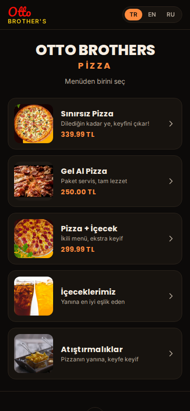
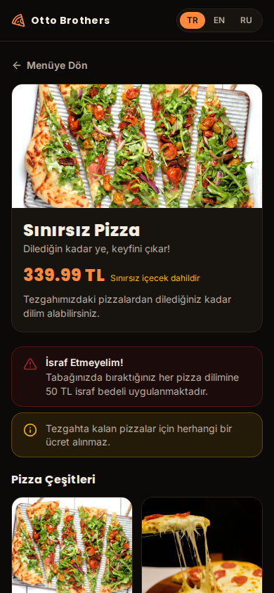
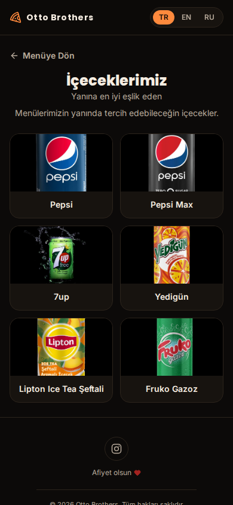
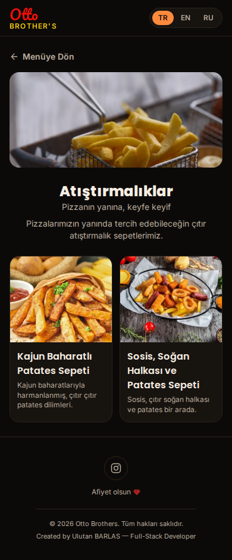

# Otto Brothers — QR Menü

Otto Brothers Pizza için hazırlanmış, tamamen ücretsiz araçlarla geliştirilip barındırılan, çok dilli ve animasyonlu bir dijital QR menü.

<p align="center">
  
  
  
  
</p>

## Öne çıkanlar

- **5 kategori, tek dokunuşla erişim** — Sınırsız Pizza, Gel Al Pizza, Pizza + İçecek, İçeceklerimiz, Atıştırmalıklar
- **Pizza dilimi temalı geçiş animasyonu** — kategoriler arası geçişte ve ilk açılışta GSAP ile özel bir "dilim birleşme/dağılma" efekti
- **İki tonlu marka logosu** — broşürdeki "Otto Brother's" yazısından ilham alan script/bold wordmark, header'da her sayfada görünür
- **3 dil desteği** — Türkçe, İngilizce, Rusça (react-i18next), tercih tarayıcıda hatırlanır
- **İşletme politikaları menüde net şekilde belirtilir** — israf bedeli uyarısı, tezgahtan/masadan artan pizzaların sokak hayvanlarına verilmesi, 0-4 yaş çocuklara ücretsiz sınırsız menü
- **Gerçek ürün fotoğrafları** — pizza çeşitleri ve tüm içecekler (Pepsi, Pepsi Max, 7up, Yedigün, Lipton Ice Tea, Fruko Gazoz) gerçek ürün görselleriyle, tutarlı siyah zeminle
- **`prefers-reduced-motion` desteği** — animasyonlar erişilebilirlik tercihine göre otomatik sadeleşir
- **Mobil öncelikli tasarım** — QR ile taranan bir menü olarak %100 telefon deneyimine göre kurgulandı

## Tech stack

| Katman | Seçim |
|---|---|
| Framework | React 19 + Vite |
| Yönlendirme | React Router (HashRouter) |
| Stil | Tailwind CSS v4 |
| Animasyon | GSAP |
| Çoklu dil | i18next / react-i18next |
| İkonlar | lucide-react + özel SVG illüstrasyonlar (içecek bardağı, favicon) |

## Proje yapısı

```
src/
├── data/menu.js          # Yapısal menü verisi (fiyat, görsel, slug)
├── locales/*.json        # tr / en / ru çevirileri (metin, politika notları, ürün adları)
├── context/               # Sayfa geçişi animasyon context'i (GSAP)
├── components/            # Kart, ikon, header/footer, politika bileşenleri
├── pages/                 # Home + kategori detay sayfaları (pizza, içecek, atıştırmalık)
└── hooks/                 # Menü içeriğini seçili dille birleştiren hook'lar
```

## Geliştirme

```bash
npm install
npm run dev       # http://localhost:5173
npm run build     # prod derleme
npm run preview   # prod build'i yerelde önizle
```

## Notlar

- Pizza görselleri işletmenin kendi ürün fotoğraflarından; içecek görselleri gerçek ürün fotoğrafları olup tutarlı bir görünüm için siyah zemine oturtulmuştur.
- Atıştırmalık sepetlerinin fiyatları işletme tarafından henüz belirlenmediği için menüde şimdilik fiyatsız gösterilir; `src/data/menu.js` içindeki `SNACKS` dizisine fiyat eklendiğinde otomatik görünür.
- Barındırma Cloudflare Pages üzerinde, tamamen ücretsiz katmanla yapılmıştır — backend veya veritabanı gerektirmez, ticari kullanım şartlarıyla tam uyumludur.

---

Created by **Ulutan BARLAS** — Full-Stack Developer
